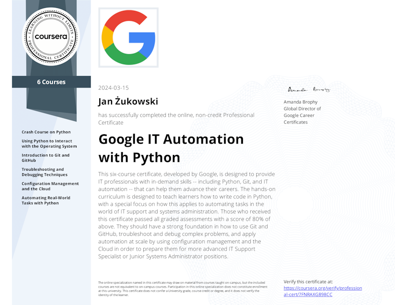

## Jan Żukowski - Baguuc

Hi, I'am a self-taught programmer, going thru high school. I am programming for a few years for now, my journey started in 2020's march.

Technologies I know and use:
* Python 
* MySQL  
* Pandas (begginer) 
* Rust (begginer) 

---

---

Also feel free to checkout my projects, there on Github 😉
